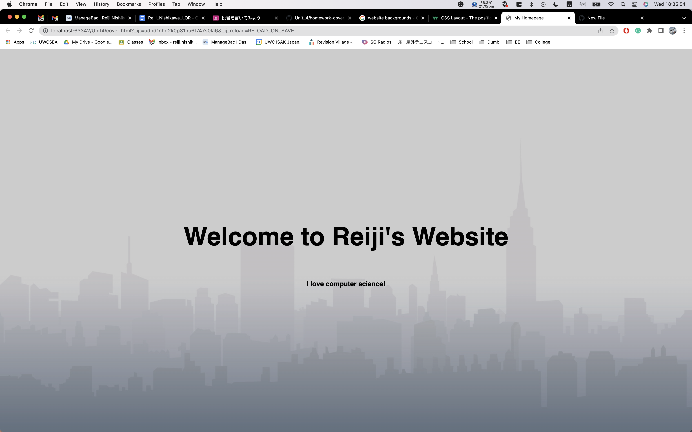

# Design your own cover with HTML and CSS

## HTML Code:
```.py
<!DOCTYPE html>
<html lang = "en">
# This creates the virtual environment within HTML
<head>
    <title>My Homepage</title>
    <link rel="stylesheet" href="style.css">
</head>
    <div class="background">
<body>
# This will create the actual content in the website, such a the text and font size
    <div class="text">
        <h1>Welcome to Reiji's Website</h1>
        <h1></h1>
        <h3>I love computer science!</h3>
      </div>

</body>
```

## CSS Code:
```.py
*{
    margin: 0;
    padding: 0;
font-family: sans-serif;
    }
    .background{
        width: 100%;
        height: 100vh;
        background-image: linear-gradient(rgba(0,0,0,0.2), rgba(0,0,0,0.2)), url(background_img.png);
        background-size: cover;
        background-position: center
    }
    .text{
        width: 100%;
        position: absolute;
        top: 50%;
        transform: translateY(-50%);
        text-align: center;
    }
    .text h1{
        font-size: 70px;
        margin-top: 80px;
    }
```


