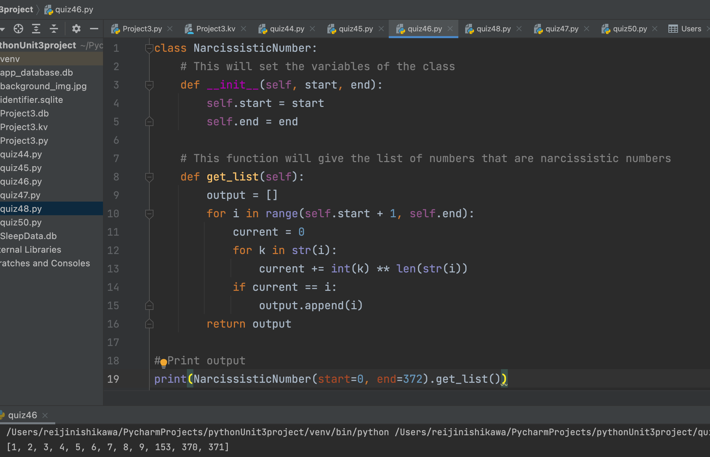

# Narcissistic Numbers 
# A narcissistic number is a number that equals the sum of its own digits each raised to the power of the number of digits.
For example, 153 is a narcissistic number because 
1^3 + 5^3 + 3^3 = 153.
The first few narcissistic numbers are: 0, 1, 2, 3, 4, 5, 6, 7, 8, 9, 153, 370, and 371.

Create a program to find the amount of narcissistic numbers between 2 given integers m and n (excluding m and n) and print them.

## Python Code

```.py
class NarcissisticNumber:
    # This will set the variables of the class
    def __init__(self, start, end):
        self.start = start
        self.end = end

    # This function will give the list of numbers that are narcissistic numbers
    def get_list(self):
        output = []
        for i in range(self.start + 1, self.end):
            current = 0
            for k in str(i):
                current += int(k) ** len(str(i))
            if current == i:
                output.append(i)
        return output

# Print output
print(NarcissisticNumber(start=0, end=372).get_list())
```

## Output


