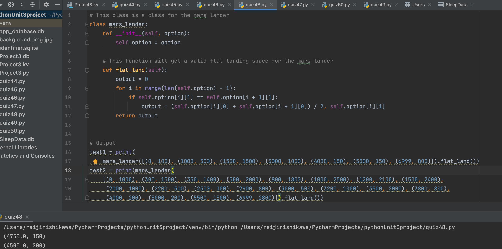

# Mars Lander 
## Create a function that given the profile of the land in a list of x,y points, it returns the middle of the only flat section (xm, ym):


### Python Code:

```.py
# This class is a class for the mars lander
class mars_lander:
    def __init__(self, option):
        self.option = option

    # This function will get a valid flat landing space for the mars lander
    def flat_land(self):
        output=0
        for i in range(len(self.option) - 1):
            if self.option[i][1] == self.option[i + 1][1]:
                output = (self.option[i][0] + self.option[i + 1][0]) / 2, self.option[i][1]
        return output
    
# Output
test1 = print(mars_lander([(0, 100), (1000, 500), (1500, 1500), (3000, 1000), (4000, 150), (5500, 150), (6999, 800)]).flat_land())
test2 = print(mars_lander([(0, 1000), (300, 1500), (350, 1400), (500, 2000), (800, 1800), (1000, 2500), (1200, 2100), (1500, 2400), (2000, 1000), (2200, 500), (2500, 100), (2900, 800), (3000, 500), (3200, 1000),(3500, 2000), (3800, 800), (4000, 200), (5000, 200), (5500, 1500), (6999, 2800)]).flat_land())
```

### Output


