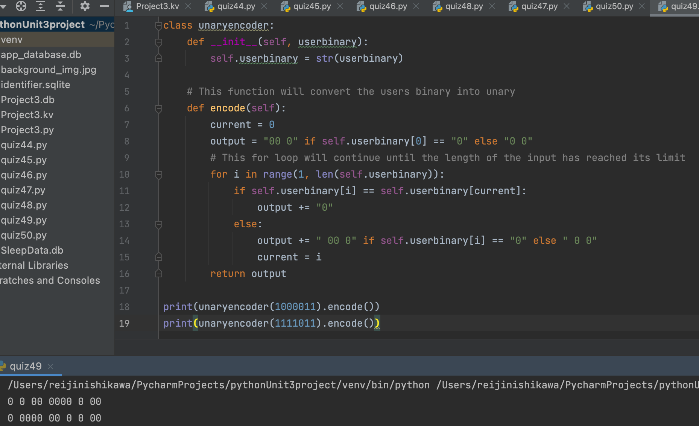

# Unary Encoder
## Binary with 0 and 1 is good, but binary with only 0, or almost, is even better! Write a program that takes an incoming message as input and displays as output the message encoded using this method.

### Python Code
```.py
class unaryencoder:
    def __init__(self, userbinary):
        self.userbinary = str(userbinary)

    # This function will convert the users binary into unary
    def encode(self):
        current = 0
        output = "00 0" if self.userbinary[0] == "0" else "0 0"
        # This for loop will continue until the length of the input has reached its limit
        for i in range(1, len(self.userbinary)):
            if self.userbinary[i] == self.userbinary[current]:
                output += "0"
            else:
                output += " 00 0" if self.userbinary[i] == "0" else " 0 0"
                current = i
        return output

print(unaryencoder(1000011).encode())
print(unaryencoder(1111011).encode())
```

### Output

