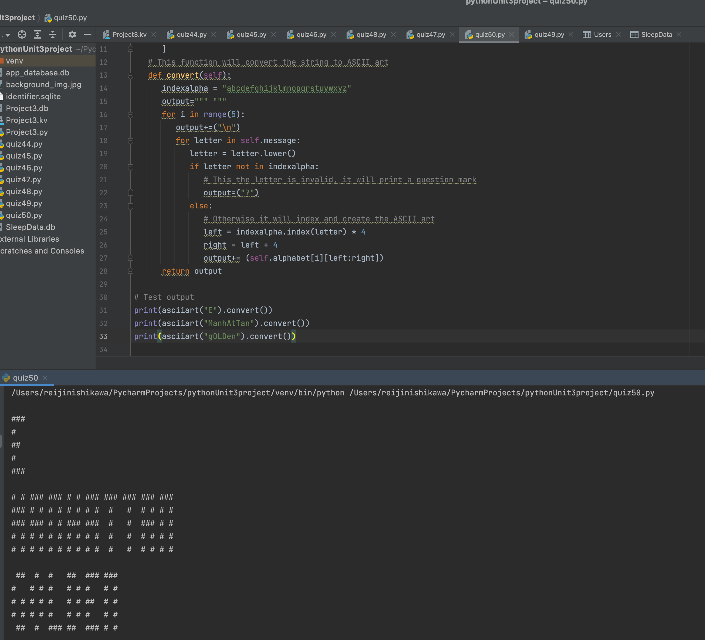

# ASCII Art
## ASCII art allows you to represent forms by using characters. To be precise, in our case, these forms are words. For example, the word "MANHATTAN" could be displayed as follows in ASCII art:

### Python code:
```.py
# This class is a class that contains the ascii art
class asciiart:
   def __init__(self, message: str):
      self.message = message
      self.alphabet = [
         "### ##   ## ##  ### ###  ## # # ###  ## # # #   # # ###  #  ##   #  ##   ## ### # # # # # # # # # # ### ###",
         "# # # # #   # # #   #   #   # #  #    # # # #   ### # # # # # # # # # # #    #  # # # # # # # # # #   #   # ",
         "### ##  #   # # ##  ##  # # ###  #    # ##  #   ### # # # # ##  # # ##   #   #  # # # # ###  #   #   #   ## ",
         "# # # # #   # # #   #   # # # #  #  # # # # #   # # # # # # #    ## # #   #  #  # # # # ### # #  #  #       ",
         "# # ##   ## ##  ### #    ## # # ###  #  # # ### # # # #  #  #     # # # ##   #  ###  #  # # # #  #  ###  #  "
      ]
   # This function will convert the string to ASCII art
   def convert(self):
      indexalpha = "abcdefghijklmnopqrstuvwxyz"
      output=""" """
      for i in range(5):
         output+=("\n")
         for letter in self.message:
            letter = letter.lower()
            if letter not in indexalpha:
               # This the letter is invalid, it will print a question mark
               output=("?")
            else:
               # Otherwise it will index and create the ASCII art
               left = indexalpha.index(letter) * 4
               right = left + 4
               output+= (self.alphabet[i][left:right])
      return output

# Test output
print(asciiart("E").convert())
print(asciiart("ManhAtTan").convert())
print(asciiart("gOLDen").convert())
```

### Output:

